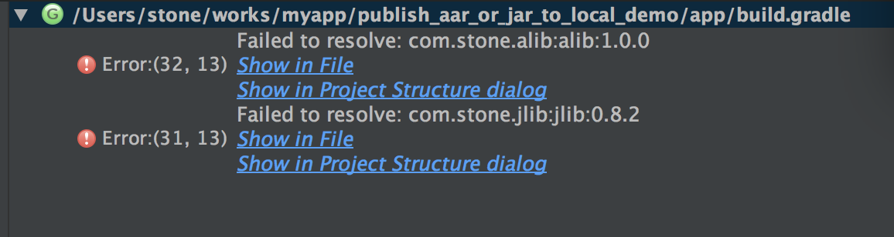

# publish_aar_or_jar_to_local_demo
一个demo, 用于演示: 如何发布aar/jar包到本地仓库

首次用Android Studio打开项目时, 会包依赖错误, 如下:  
  
因为主app module依赖于alib和jlib, 而这两个被依赖的库的包还没生成   
解决gradle错误的步骤如下:   
1. 请先注释掉下`app/build.gadle`文件里面的依赖语句(两句compile ....)   
2. 在执行下面的命令生成下面的依赖包:  
    `./gradlew :alib:clean :alib:uploadArchives`  
    `./gradlew :jlib:clean :jlib:uploadArchives`   
3. 现在放开第一步注释掉的两句依赖语句, 同步项目 (点击Android Studio的toolbar上的`Sync Project with gradle Files`按钮)    
这样就可以正常使用了  

关于此项目的说明请参考:
[http://www.jianshu.com/p/0629548ab5a4](http://www.jianshu.com/p/0629548ab5a4)

